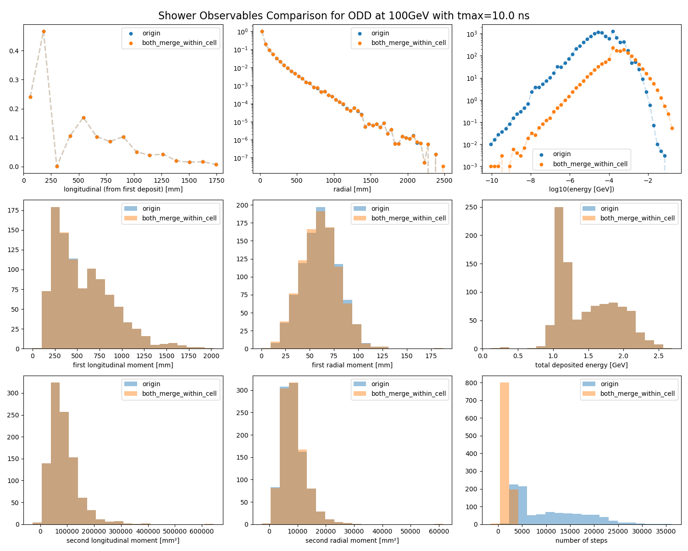
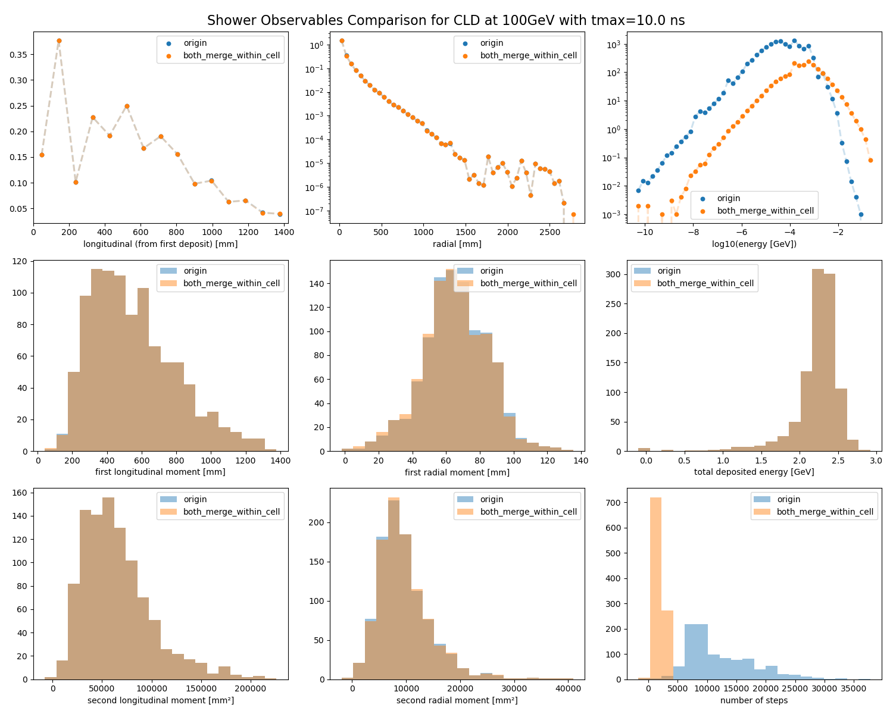

# Data Representation Optimization for ML-Based Calorimeter Simulation

**Contributor:** Siyu (Rain) Chen  
**Mentors:** Peter McKeown and Anna Zaborowska  
**Organization:** CERN-HSF  
**Program:** [Google Summer of Code 2026](https://summerofcode.withgoogle.com/programs/2026/projects/QN28h4Fl)  
**Upstream repository:** [fast-sim/step2point](https://github.com/fast-sim/step2point)

---

## Table of Contents

- [1. Problem Definition and Approach](#1-problem-definition-and-approach)
  - [1.1 Context](#11-context)
  - [1.2 Problem](#12-problem)
  - [1.3 Approach](#13-approach)
  - [1.4 Success Criteria](#14-success-criteria)
- [2. What I Have Done](#2-what-i-have-done)
  - [2.1 Dataset Generation](#21-dataset-generation)
  - [2.2 Multi-Collection Support in step2point](#22-multi-collection-support-in-step2point)
  - [2.3 CLD Compact XML Support](#23-cld-compact-xml-support)
  - [2.4 Electromagnetic and Hadronic Shower Separation](#24-electromagnetic-and-hadronic-shower-separation)
  - [2.5 Compression Pipeline](#25-compression-pipeline)
  - [2.6 Merging and Event Alignment](#26-merging-and-event-alignment)
- [3. Tooling for Evaluation](#3-tooling-for-evaluation)
- [4. Results](#4-results)
- [5. Discussion](#5-discussion)
- [6. How to Run](#6-how-to-run)
- [7. Repository Structure](#7-repository-structure)
- [8. Conclusion](#8-conclusion)
- [9. Acknowledgements](#9-acknowledgements)
- [References](#references)

---

## 1. Problem Definition and Approach

### 1.1 Context

Detailed calorimeter shower simulation with Geant4 in the new detector era is going to be computationally expensive. Machine-learning-based surrogate models can accelerate this process, but their training data must be both compact and physically meaningful. A useful representation should preserve the spatial and energy structure of a shower while avoiding unnecessary dependence on a particular detector's readout segmentation.

The [`step2point`](https://github.com/fast-sim/step2point) project converts the original detailed energy-deposition steps into point-cloud representations and provides several algorithms for reducing the number of points. This project extends that workflow from a primarily single-collection electromagnetic use case to realistic detector datasets containing multiple calorimeter collections and both electromagnetic and hadronic shower components.

### 1.2 Problem

Realistic calorimeter simulations introduce several challenges:

- A detector contains multiple readout collections, such as the electromagnetic and hadronic barrel and endcap calorimeters.
- Different collections can use different cell-ID encodings, layer definitions, and segmentation parameters.
- Detector geometry is described by nested DD4hep compact XML files whose constants are not always plain Python-style numerical expressions.
- Hadronic showers contain both electromagnetic and non-electromagnetic contributions, which may respond differently to a compression algorithm.
- Point reduction must preserve event alignment, metadata, energy, and calorimetric shower observables.

**Goal:** Build and validate a reproducible pipeline that produces compressed point-cloud datasets for both the Open Data Detector (ODD) and CLD, across multiple incident energies, algorithms, and timing selections.

### 1.3 Approach

The project follows the complete data path from event generation to physics validation:

1. Generate reproducible HepMC3 inputs with configurable particles, energies, vertices, and incident directions.
2. Simulate calorimeter showers with DD4hep and store them in EDM4hep ROOT files.
3. Split each shower into electromagnetic and hadronic components at the `CaloHitContribution` level.
4. Convert the ROOT files to the HDF5 format used by `step2point`.
5. Apply common time cuts to all point-aligned HDF5 datasets.
6. Compress each component with several `step2point` algorithms.
7. Merge the components while keeping all fields synchronized within each event.
8. Compare the compressed samples with the original showers using energy-weighted spatial observables.

### 1.4 Success Criteria

- **Generality:** process both ODD and CLD detector descriptions.
- **Multi-collection correctness:** keep points associated with the correct readout collection and decode them with the matching geometry.
- **Energy closure:** preserve the expected total energy, except for energy intentionally removed by a time cut or component selection.
- **Shower preservation:** retain longitudinal, radial, and azimuthal energy profiles and their first and second moments.
- **Compression:** substantially reduce the number of shower points.
- **Reproducibility:** automate the same workflow across detector models, energies, time cuts, and algorithms.

---

## 2. What I Have Done

### 2.1 Dataset Generation

`generate_hepmc_with_vertex.py` is used to generate HepMC3 AsciiV3 events with explicit production vertices. It supports:

- photons, electrons, charged pions, and muons through their PDG IDs;
- fixed, uniform, and log-uniform energy sampling;
- fixed or uniformly sampled production positions;
- fixed directions or directions sampled inside a cone;
- angle scans and energy scans; and
- deterministic generation with a configurable random seed.

The generated events can be passed to `ddsim` to produce controlled samples for detector and incident-angle studies. Fixed-position and fixed-direction samples were also used to cross-check the HepMC-based workflow against the DD4hep particle gun.

### 2.2 Multi-Collection Support in step2point

A major contribution of this project is extending `step2point` to process more than one calorimeter collection in a single shower. In particular, the `merge_within_regular_subcell` workflow was generalized so that collection-specific parameters can be provided as lists:

```bash
--collection-name ECalBarrelCollection HCalBarrelCollection \
--grid-x 3 3 \
--grid-y 3 3 \
--position-mode weighted weighted
```

The implementation:

- maps every point to its original collection using shower metadata;
- applies the correct cell-ID encoding and detector layout to each collection;
- decodes and groups only the points belonging to the active collection;
- prevents points from different subdetectors from being merged together;
- supports independent grid sizes and output-position modes per collection; and
- retains backward compatibility for single-collection inputs.

Unit tests were added for both single- and multi-collection cases, including showers whose collections use different detector system IDs.

### 2.3 CLD Compact XML Support

The compact XML reader was extended to support the CLD detector description in addition to ODD. CLD XML files contain nested includes, detector constants, readout definitions, and DD4hep ID descriptors that cannot all be parsed as ordinary numerical Python expressions.

The updated reader:

- follows the relevant compact XML structure and included definitions;
- preserves DD4hep ID strings such as bit-field encodings instead of evaluating them as arithmetic expressions;
- resolves constants needed by the calorimeter layouts;
- extracts collection-specific readout and segmentation information; and
- allows the same compression interface to be used for ODD and CLD.

This work exposed detector-specific assumptions that were harmless for ODD but invalid for CLD, especially assumptions about layer numbering, barrel geometry, and the relationship between a collection and a single encoding.

### 2.4 Electromagnetic and Hadronic Shower Separation

The scripts `remove_hadronic.py` and `remove_em.py` split EDM4hep calorimeter hits using the PDG ID of each `CaloHitContribution`:

```python
EM_PDGS = {11, -11, 22}
```

- The **EM sample** retains contributions from electrons, positrons, and photons.
- The **hadronic sample** retains all other contributions.

For every retained hit, the scripts:

- preserve the original cell ID and hit position;
- reconstruct the hit energy from the retained contributions;
- create collection-owned contribution objects so that PODIO relations remain valid;
- drop hits with no remaining contributions; and
- copy event-level collections such as `MCParticles` unchanged.

This separation makes it possible to study whether electromagnetic and hadronic components should use the same compression strategy or be compressed independently.

### 2.5 Compression Pipeline

`pipeline_compress_em_hadronic.py` automates the full workflow for ODD and CLD. The tested incident-particle samples are negatively charged pions at several energies, with detector-front positions chosen for the corresponding barrel geometry.

The pipeline evaluates two timing selections:

- `t <= 10 ns`, representing a tight timing window;
- `t <= 400 ns`, retaining late hadronic activity.

Every point-aligned dataset receives the same Boolean mask, preventing fields such as position, energy, time, cell ID, PDG ID, and track ID from becoming misaligned.

Four `step2point` algorithms are included:

| Algorithm | Purpose |
| --- | --- |
| `identity` | Uncompressed reference produced through the same I/O path |
| `merge_within_cell` | Merge all steps assigned to the same detector cell |
| `merge_within_regular_subcell` | Divide cells into a configurable regular sub-grid and merge within each subcell |
| `hdbscan` | Density-based clustering, optionally including time |

To isolate where differences originate, the pipeline creates three types of merged output:

1. the same algorithm applied to both EM and hadronic components;
2. identity EM combined with compressed hadronic activity; and
3. compressed EM combined with identity hadronic activity.

### 2.6 Merging and Event Alignment

`merge.py` recombines complementary EM and hadronic HDF5 files. Before writing an output file, it validates the required datasets, dimensions, and event IDs.

For every event, it concatenates all available point-aligned fields and applies one shared ordering to every field. The standalone merger can use time and deterministic spatial keys to make the output reproducible. The pipeline merger uses a stable time sort and merges over the union of EM and hadronic event IDs, since one component can become empty after a time cut.

The merger also:

- preserves optional datasets only when they are available in both inputs;
- copies primary-particle and metadata information once instead of duplicating it; and
- reports events that appear in only one component.

---

## 3. Tooling for Evaluation

### `inspect_showers.py`

The original shower-inspection workflow in `step2point` supported the analysis and visualization of only one dataset at a time. This verison extended it to accept multiple HDF5 datasets and overlay their distributions in the same comparison matrix. This makes it possible to directly compare an original dataset with one or more compressed datasets using consistent selections, coordinate definitions, histogram bins, and plotting ranges.

For every dataset, the script processes showers event by event and applies the same time selection. A fixed physics-motivated shower axis can be supplied, or the axis can be estimated using energy-weighted PCA. The step positions are then transformed into cylindrical coordinates around the shower axis:

$$
\ell_i = (\mathbf{x}_i - \mathbf{c}) \cdot \hat{\mathbf{a}},
$$

$$
r_i =
\left\lVert
(\mathbf{x}_i - \mathbf{c}) - \ell_i\hat{\mathbf{a}}
\right\rVert.
$$

Here, $\mathbf{x}_i$ is the energy-weighted centroid and $\hat{\mathbf{a}}$ is the shower axis. The longitudinal coordinate can be anchored to the first energy deposit to ensure that the comparison is not dominated by an arbitrary centroid shift.

The extended plotting interface accepts multiple input files, labels, and colors. It calculates shared histogram bins from all supplied datasets and overlays their distributions in the same panels. This allows differences between the original and compressed showers to be identified directly without comparing separately generated figures.

The comparison matrix contains:

* energy-weighted longitudinal, radial, and azimuthal shower profiles;
* the per-point `log10(E)` distribution;
* total shower energy;
* first longitudinal and radial moments;
* second longitudinal and radial moments; and
* the number of points before and after compression.

Using shared bins, plotting ranges, time cuts, and shower-axis definitions ensures that all overlaid datasets are compared under the same conditions. The tool can therefore compare not only an original and a single compressed dataset, but also several algorithms or EM/hadronic compression configurations in one figure.

Example:

```bash
python inspect_showers.py \
  --input original.h5 compressed_hdbscan.h5 compressed_subcell.h5 \
  --labels origin hdbscan regular_subcell \
  --colors "#1f77b4" "#ff7f0e" "#2ca02c" \
  --axis 0 1 0 \
  --detector ODD \
  --energy 100GeV \
  --tmax 10 \
  --label algorithm_comparison \
  --outdir plots
```

---

## 4. Results

The evaluation covers:

- **detectors:** ODD and CLD;
- **incident particle:** $\pi^-$;
- **energies:** 1 GeV, 10 GeV, and 100 GeV;
- **time cuts:** 10 ns and 400 ns; 
- **algorithms:** identity, merge-within-cell, regular-subcell merging, and HDBSCAN.

The main qualitative observations are:

- The identity split-and-merge path provides a closure test for the EM/hadronic workflow.
- A 10 ns cut removes substantially more late hadronic activity than a 400 ns cut, so timing must be treated as part of the dataset definition rather than as a plotting-only choice.
- Regular-subcell merging provides an explicit fidelity/compression control through the grid size and can retain more spatial information than merging an entire readout cell.
- Compressing EM and hadronic components independently helps identify which component is responsible for a change in a shower observable.
- Correct collection-to-layout mapping is essential. Applying one collection's geometry to another can produce large, non-physical coordinate shifts even when the output file is structurally valid.
- ODD and CLD require separate validation because their geometries, encodings, and layer conventions differ.

### Example Comparison Plots

Add selected figures to a `results/` directory and replace the placeholder paths below with the final filenames:

```markdown



```


---

## 5. Discussion

### Multi-Collection Processing

Multi-collection support is not only a command-line extension. Each point must remain associated with its original collection throughout decoding, layer lookup, position calculation, and merging. A global decoded array or a reused collection mask is used to silently mix geometries and create incorrect output coordinates. The revised design therefore performs collection-local decoding and maps the result back to global point indices.

### CLD Geometry

Supporting CLD revealed several assumptions that should not be embedded in a general data-representation tool. Layer identifiers do not necessarily map directly to zero-based positions in a parsed layout list, and compact XML constants may represent DD4hep descriptor strings rather than numerical expressions. Parsing and geometry lookup must preserve these distinctions.

### EM and Hadronic Components

Hadronic showers contain delayed and spatially diffuse activity that is less prominent in electromagnetic showers. Consequently, an algorithm and time cut that work well for the EM core may remove or over-merge important hadronic structure. The component-wise pipeline makes these effects visible and allows separate parameter choices when needed.

---

## 6. How to Run

### 6.1 Environment

The workflow was developed in a Key4hep environment and uses Python packages including:

- `numpy`
- `h5py`
- `matplotlib`
- `pyhepmc`
- `podio`
- `edm4hep`
- `step2point`

Activate a Key4hep stack that provides DD4hep, PODIO, and EDM4hep before running the ROOT-processing scripts. Install the development version of `step2point` containing the multi-collection and CLD XML changes.

### 6.2 Generate HepMC Input

```bash
python generate_hepmc_with_vertex.py \
  --output piminus_10GeV.hepmc \
  --n-events 1000 \
  --pdg-id -211 \
  --energy-mode fixed \
  --energy 10 \
  --fixed-x 0 \
  --fixed-y 0 \
  --fixed-z 0 \
  --dir-x 0 \
  --dir-y 1 \
  --dir-z 0 \
  --seed 42
```

For an angle scan:

```bash
python generate_hepmc_with_vertex.py \
  --output photon_scan.hepmc \
  --pdg-id 22 \
  --energy 10 \
  --angle-axis +y \
  --angle-scan \
  --angles 0 5 10 15 20 30 \
  --events-per-angle 100
```

### 6.3 Split EM and Hadronic Contributions

```bash
python remove_hadronic.py input.root input_em.root
python remove_em.py input.root input_hadronic.root
```

### 6.4 Run Multi-Collection Compression

```bash
python /path/to/step2point/examples/run_step2point_pipeline.py \
  --input input_timecut_10ns.h5 \
  --compact-xml /path/to/detector.xml \
  --algorithm merge_within_regular_subcell \
  --collection-name ECalBarrelCollection HCalBarrelCollection \
  --grid-x 3 3 \
  --grid-y 3 3 \
  --position-mode weighted weighted \
  --axis 0 1 0 \
  --output output_directory
```

### 6.5 Run the Full Study

Edit the paths and dataset lists at the beginning of `pipeline_compress_em_hadronic.py`, then run:

```bash
python pipeline_compress_em_hadronic.py
```

The pipeline skips completed intermediate products, logs failed algorithm configurations without discarding successful ones, and creates comparison plots for all merged configurations.

---

## 7. Repository Structure

```text
.
├── helper/
│    ├── generate_hepmc_with_vertex.py       # configurable HepMC3 event generation
│    ├── remove_em.py                        # remove EM contributions; retain hadronic component
│    ├── remove_hadronic.py                  # remove hadronic contributions; retain EM component
│    ├── merge.py                            # validated EM/HAD HDF5 merger
│    ├── pipeline_compress_em_hadronic.py    # end-to-end compression study
│    ├── inspect_showers.py                  # observable calculation and plotting
└── results/                            # selected final comparison figures
```

The changes to the compression algorithms, geometry parsing, command-line interface, and tests are maintained in the upstream [`fast-sim/step2point`](https://github.com/fast-sim/step2point) project.

---

## 8. Conclusion

This project extends the `step2point` data-representation workflow toward realistic, detector-wide calorimeter datasets. The main software contributions are multi-collection processing and CLD compact XML support, complemented by a reproducible pipeline for event generation, EM/hadronic separation, timing selections, compression, merging, and physics validation.

The resulting workflow can compare multiple point-cloud representations without losing the connection between a shower point and its detector collection. It also provides the component-level diagnostics needed to determine whether an observed difference originates in electromagnetic compression, hadronic compression, timing selection, geometry parsing, or file merging.

---

## 9. Acknowledgements

I would like to sincerely thank my mentors, Peter McKeown and Anna Zaborowska, for their support and guidance throughout the project. Whenever I encountered a question or difficulty, they suggested several possible approaches and helped me reason through the problem while still giving me the space to develop and test my own solutions. Their feedback was invaluable in shaping the entire workflow, and this project has been a wonderful learning experience.

---

## References

1. A. Zaborowska and P. McKeown, [*The step2point dataset*](https://arxiv.org/abs/2509.22340), arXiv:2509.22340.
2. [`fast-sim/step2point`](https://github.com/fast-sim/step2point), the point-cloud construction and evaluation framework extended in this project.
3. [CERN-HSF Google Summer of Code](https://hepsoftwarefoundation.org/activities/gsoc.html).
4. [DD4hep](https://dd4hep.web.cern.ch/), a detector description toolkit used for the detailed simulations.
5. [EDM4hep](https://github.com/key4hep/EDM4hep), the event data model used by the ROOT simulation files.
